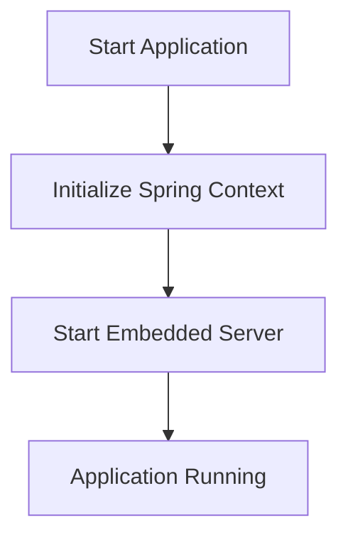

# Documentation for DepositInterestSystemApplication

## Description
The `DepositInterestSystemApplication` class is the entry point for a Spring Boot application that manages a deposit interest system. It initializes the Spring application context and starts the embedded server.

## Methods

### `main(String[] args)`
- **Parameters**:
  - `args`: An array of `String` arguments passed from the command line. These can be used to configure the application at runtime.
  
- **Return Value**:
  - This method does not return a value (void). It starts the Spring application.

- **Usage Example**:
  To run the application, you can execute the following command in the terminal:
  ```bash
  java -jar deposit-interest-system.jar
  ```
  Alternatively, if you are using an IDE like Visual Studio Code, you can run the application directly from the IDE.

## Important Notes
- Ensure that you have the necessary Spring Boot dependencies in your project to run this application.
- The application will start an embedded server (like Tomcat) by default, which can be accessed at `http://localhost:8080` unless configured otherwise.

## Flowchart


This flowchart illustrates the basic flow of the application startup process.