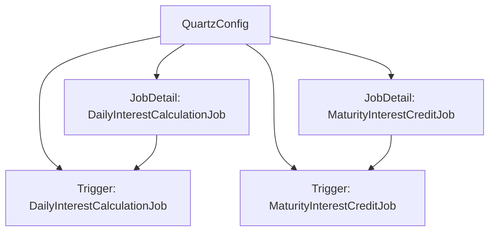

# QuartzConfig Documentation

## Description
The `QuartzConfig` class is a Spring configuration class that sets up two scheduled jobs using the Quartz job scheduling library. It defines job details and triggers for daily interest calculations and maturity interest crediting. The jobs are configured to run at specific times each day.

## Methods

### 1. `dailyInterestCalculationJobDetail()`
- **Description**: Creates a `JobDetail` instance for the `DailyInterestCalculationJob`.
- **Parameters**: None
- **Return Value**: Returns a `JobDetail` object configured for the daily interest calculation job.
- **Usage Example**:
    ```java
    JobDetail jobDetail = quartzConfig.dailyInterestCalculationJobDetail();
    System.out.println(jobDetail.getKey()); // Output: dailyInterestCalculationJob
    ```

### 2. `dailyInterestCalculationJobTrigger()`
- **Description**: Creates a `Trigger` instance that schedules the `DailyInterestCalculationJob` to run daily at midnight (00:00).
- **Parameters**: None
- **Return Value**: Returns a `Trigger` object configured to trigger the daily interest calculation job.
- **Usage Example**:
    ```java
    Trigger trigger = quartzConfig.dailyInterestCalculationJobTrigger();
    System.out.println(trigger.getKey()); // Output: dailyInterestCalculationTrigger
    ```

### 3. `maturityInterestCreditJobDetail()`
- **Description**: Creates a `JobDetail` instance for the `MaturityInterestCreditJob`.
- **Parameters**: None
- **Return Value**: Returns a `JobDetail` object configured for the maturity interest credit job.
- **Usage Example**:
    ```java
    JobDetail jobDetail = quartzConfig.maturityInterestCreditJobDetail();
    System.out.println(jobDetail.getKey()); // Output: maturityInterestCreditJob
    ```

### 4. `maturityInterestCreditJobTrigger()`
- **Description**: Creates a `Trigger` instance that schedules the `MaturityInterestCreditJob` to run daily at 6 AM (06:00).
- **Parameters**: None
- **Return Value**: Returns a `Trigger` object configured to trigger the maturity interest credit job.
- **Usage Example**:
    ```java
    Trigger trigger = quartzConfig.maturityInterestCreditJobTrigger();
    System.out.println(trigger.getKey()); // Output: maturityInterestCreditTrigger
    ```

## Important Notes
- Ensure that the `DailyInterestCalculationJob` and `MaturityInterestCreditJob` classes are properly implemented and annotated as Quartz jobs.
- The scheduling times are set using the `CronScheduleBuilder`, which allows for flexible scheduling options. Adjust the parameters in `dailyAtHourAndMinute(hour, minute)` as needed.
- This configuration class must be scanned by Spring to be effective, so ensure it is included in the component scan.

## Flowchart


This documentation provides a clear understanding of the `QuartzConfig` class and its methods, enabling developers to effectively utilize and modify the job scheduling configuration as needed.