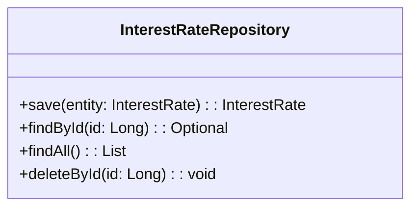

# Documentation for `InterestRateRepository.java`

## Description
The `InterestRateRepository` interface is part of the Data Access Object (DAO) layer in a Spring application. It extends the `JpaRepository` interface provided by Spring Data JPA, allowing for CRUD (Create, Read, Update, Delete) operations on `InterestRate` entities. The repository is responsible for interacting with the database to manage interest rate data.

## Methods

### Inherited Methods from `JpaRepository`
Since `InterestRateRepository` extends `JpaRepository`, it inherits several methods for data manipulation. Below are some key methods:

1. **save(S entity)**  
   - **Parameter**: 
     - `entity`: An instance of `InterestRate` to be saved.
   - **Return Value**: 
     - Returns the saved `InterestRate` entity.
   - **Usage Example**:
     ```java
     InterestRate interestRate = new InterestRate();
     interestRate.setRate(5.0);
     InterestRate savedRate = interestRateRepository.save(interestRate);
     ```

2. **findById(Long id)**  
   - **Parameter**: 
     - `id`: The unique identifier of the `InterestRate` entity to retrieve.
   - **Return Value**: 
     - Returns an `Optional<InterestRate>` containing the found entity or empty if not found.
   - **Usage Example**:
     ```java
     Optional<InterestRate> rate = interestRateRepository.findById(1L);
     rate.ifPresent(System.out::println);
     ```

3. **findAll()**  
   - **Parameter**: 
     - None.
   - **Return Value**: 
     - Returns a `List<InterestRate>` containing all interest rate entities.
   - **Usage Example**:
     ```java
     List<InterestRate> rates = interestRateRepository.findAll();
     rates.forEach(System.out::println);
     ```

4. **deleteById(Long id)**  
   - **Parameter**: 
     - `id`: The unique identifier of the `InterestRate` entity to delete.
   - **Return Value**: 
     - Returns void.
   - **Usage Example**:
     ```java
     interestRateRepository.deleteById(1L);
     ```

## Important Notes
- Ensure that the `InterestRate` entity is properly annotated with JPA annotations (e.g., `@Entity`, `@Table`) to facilitate database operations.
- The `InterestRateRepository` interface does not require implementation; Spring Data JPA automatically provides the implementation at runtime.
- Consider using transactions when performing multiple operations to maintain data integrity.

## Mermaid Diagram


This documentation provides a concise overview of the `InterestRateRepository` interface, detailing its purpose, methods, and usage examples to assist developers in understanding and utilizing the code effectively.