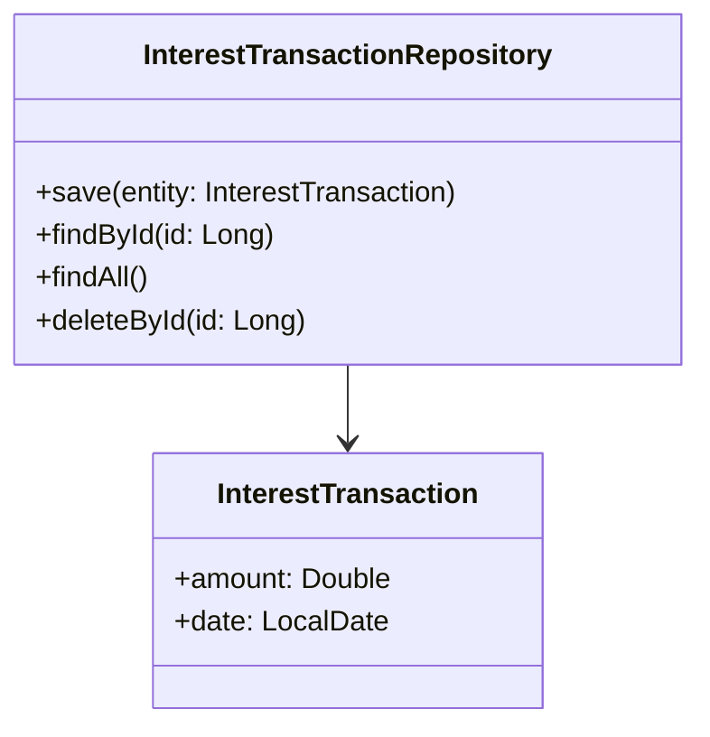

# Documentation for `InterestTransactionRepository`

## Description
The `InterestTransactionRepository` interface is a Spring Data JPA repository that provides CRUD (Create, Read, Update, Delete) operations for the `InterestTransaction` entity. It extends the `JpaRepository` interface, which offers a set of methods for interacting with the database without the need for boilerplate code.

## Methods
As `InterestTransactionRepository` extends `JpaRepository`, it inherits several methods. Below are the key methods available:

### 1. `save(S entity)`

#### Parameter Explanations
- `entity`: An instance of `InterestTransaction` to be saved in the database.

#### Return Value Description
- Returns the saved `InterestTransaction` entity.

#### Usage Example
```java
InterestTransaction transaction = new InterestTransaction();
transaction.setAmount(100.0);
transaction.setDate(LocalDate.now());
InterestTransaction savedTransaction = interestTransactionRepository.save(transaction);
```

### 2. `findById(ID id)`

#### Parameter Explanations
- `id`: The primary key of the `InterestTransaction` entity, of type `Long`.

#### Return Value Description
- Returns an `Optional<InterestTransaction>` containing the found entity or empty if not found.

#### Usage Example
```java
Optional<InterestTransaction> transaction = interestTransactionRepository.findById(1L);
transaction.ifPresent(t -> System.out.println(t.getAmount()));
```

### 3. `findAll()`

#### Parameter Explanations
- No parameters.

#### Return Value Description
- Returns a `List<InterestTransaction>` containing all `InterestTransaction` entities in the database.

#### Usage Example
```java
List<InterestTransaction> transactions = interestTransactionRepository.findAll();
transactions.forEach(t -> System.out.println(t.getAmount()));
```

### 4. `deleteById(ID id)`

#### Parameter Explanations
- `id`: The primary key of the `InterestTransaction` entity to be deleted, of type `Long`.

#### Return Value Description
- No return value.

#### Usage Example
```java
interestTransactionRepository.deleteById(1L);
```

## Important Notes
- Ensure that the `InterestTransaction` entity is properly annotated with JPA annotations (e.g., `@Entity`, `@Table`) to facilitate database operations.
- This repository interface is automatically implemented by Spring Data JPA, so no additional implementation is required.
- Consider using transactions when performing multiple operations to maintain data integrity.

## Mermaid Diagram


This documentation provides a clear understanding of the `InterestTransactionRepository` interface, its methods, and how to use them effectively.