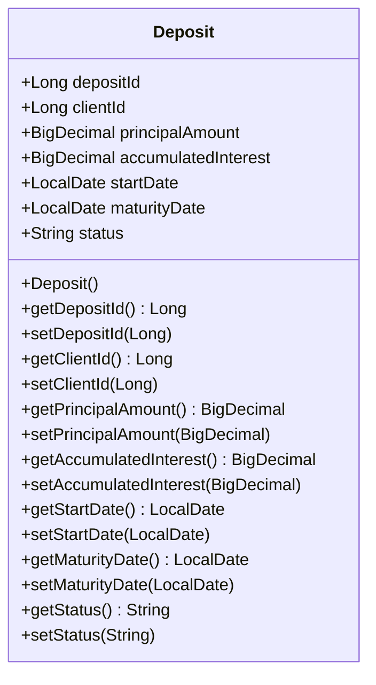

# Deposit Class Documentation

## Description
The `Deposit` class represents a financial deposit entity in a banking application. It is annotated with JPA (Java Persistence API) annotations to facilitate ORM (Object-Relational Mapping) with a relational database. The class contains attributes related to a deposit, including the deposit ID, client ID, principal amount, accumulated interest, start date, maturity date, and status.

## Attributes
- `depositId`: Unique identifier for the deposit.
- `clientId`: Identifier for the client associated with the deposit.
- `principalAmount`: The initial amount deposited.
- `accumulatedInterest`: The interest accrued on the deposit.
- `startDate`: The date when the deposit was made.
- `maturityDate`: The date when the deposit matures.
- `status`: The current status of the deposit (e.g., active, closed).

## Methods

### 1. `Deposit()`
- **Description**: Default constructor for the `Deposit` class.

### 2. `Long getDepositId()`
- **Returns**: The unique identifier of the deposit.
- **Usage**:
  ```java
  Deposit deposit = new Deposit();
  Long id = deposit.getDepositId();
  ```

### 3. `void setDepositId(Long depositId)`
- **Parameter**: 
  - `depositId`: The unique identifier to set for the deposit.
- **Usage**:
  ```java
  Deposit deposit = new Deposit();
  deposit.setDepositId(1L);
  ```

### 4. `Long getClientId()`
- **Returns**: The client ID associated with the deposit.
- **Usage**:
  ```java
  Long clientId = deposit.getClientId();
  ```

### 5. `void setClientId(Long clientId)`
- **Parameter**: 
  - `clientId`: The client ID to set for the deposit.
- **Usage**:
  ```java
  deposit.setClientId(123L);
  ```

### 6. `BigDecimal getPrincipalAmount()`
- **Returns**: The principal amount of the deposit.
- **Usage**:
  ```java
  BigDecimal principal = deposit.getPrincipalAmount();
  ```

### 7. `void setPrincipalAmount(BigDecimal principalAmount)`
- **Parameter**: 
  - `principalAmount`: The principal amount to set for the deposit.
- **Usage**:
  ```java
  deposit.setPrincipalAmount(new BigDecimal("1000.00"));
  ```

### 8. `BigDecimal getAccumulatedInterest()`
- **Returns**: The accumulated interest on the deposit.
- **Usage**:
  ```java
  BigDecimal interest = deposit.getAccumulatedInterest();
  ```

### 9. `void setAccumulatedInterest(BigDecimal accumulatedInterest)`
- **Parameter**: 
  - `accumulatedInterest`: The accumulated interest to set for the deposit.
- **Usage**:
  ```java
  deposit.setAccumulatedInterest(new BigDecimal("50.00"));
  ```

### 10. `LocalDate getStartDate()`
- **Returns**: The start date of the deposit.
- **Usage**:
  ```java
  LocalDate startDate = deposit.getStartDate();
  ```

### 11. `void setStartDate(LocalDate startDate)`
- **Parameter**: 
  - `startDate`: The start date to set for the deposit.
- **Usage**:
  ```java
  deposit.setStartDate(LocalDate.now());
  ```

### 12. `LocalDate getMaturityDate()`
- **Returns**: The maturity date of the deposit.
- **Usage**:
  ```java
  LocalDate maturityDate = deposit.getMaturityDate();
  ```

### 13. `void setMaturityDate(LocalDate maturityDate)`
- **Parameter**: 
  - `maturityDate`: The maturity date to set for the deposit.
- **Usage**:
  ```java
  deposit.setMaturityDate(LocalDate.now().plusMonths(12));
  ```

### 14. `String getStatus()`
- **Returns**: The status of the deposit.
- **Usage**:
  ```java
  String status = deposit.getStatus();
  ```

### 15. `void setStatus(String status)`
- **Parameter**: 
  - `status`: The status to set for the deposit.
- **Usage**:
  ```java
  deposit.setStatus("active");
  ```

## Important Notes
- Ensure that the `BigDecimal` values for `principalAmount` and `accumulatedInterest` are initialized with appropriate precision and scale to avoid rounding issues.
- The `status` field should be managed carefully to reflect the current state of the deposit accurately.

## Mermaid Diagram
