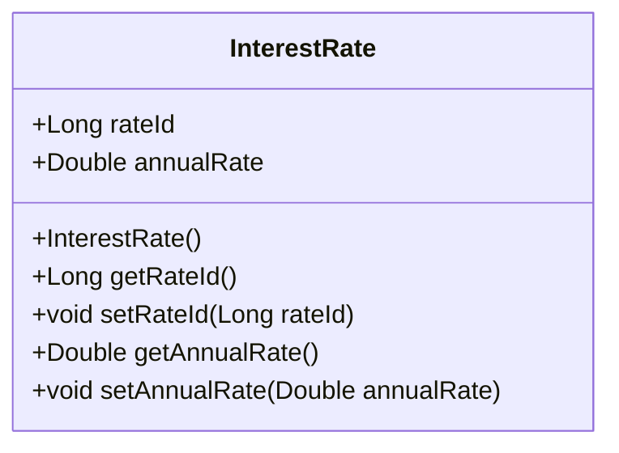

# Documentation for `InterestRate` Class

## Description
The `InterestRate` class represents an entity that stores interest rate information in a database. It is annotated with JPA (Java Persistence API) annotations to facilitate ORM (Object-Relational Mapping) with a database table named `interest_rates`. The class contains fields for the rate ID and the annual interest rate.

## Class Structure

### Annotations
- `@Entity`: Indicates that this class is a JPA entity.
- `@Table(name = "interest_rates")`: Specifies the database table to which this entity is mapped.
- `@Id`: Marks the field as the primary key.
- `@Column`: Specifies the details of the column in the database.

## Methods

### Constructor
```java
public InterestRate() {}
```
- **Description**: Default constructor for the `InterestRate` class.

### Getter and Setter Methods

#### `getRateId()`
```java
public Long getRateId() { return rateId; }
```
- **Return Value**: Returns the `rateId` of type `Long`.
- **Usage Example**:
  ```java
  InterestRate interestRate = new InterestRate();
  Long id = interestRate.getRateId();
  ```

#### `setRateId(Long rateId)`
```java
public void setRateId(Long rateId) { this.rateId = rateId; }
```
- **Parameter**: 
  - `rateId`: A `Long` value representing the unique identifier for the interest rate.
- **Usage Example**:
  ```java
  InterestRate interestRate = new InterestRate();
  interestRate.setRateId(1L);
  ```

#### `getAnnualRate()`
```java
public Double getAnnualRate() { return annualRate; }
```
- **Return Value**: Returns the `annualRate` of type `Double`.
- **Usage Example**:
  ```java
  InterestRate interestRate = new InterestRate();
  Double rate = interestRate.getAnnualRate();
  ```

#### `setAnnualRate(Double annualRate)`
```java
public void setAnnualRate(Double annualRate) { this.annualRate = annualRate; }
```
- **Parameter**: 
  - `annualRate`: A `Double` value representing the annual interest rate.
- **Usage Example**:
  ```java
  InterestRate interestRate = new InterestRate();
  interestRate.setAnnualRate(3.5);
  ```

## Important Notes
- Ensure that the `rateId` is unique for each instance of `InterestRate` as it serves as the primary key.
- The `annualRate` field is defined with a precision of 10 and a scale of 6, allowing for detailed representation of interest rates.

## Mermaid Diagram


This documentation provides a comprehensive overview of the `InterestRate` class, its methods, and how to use them effectively.