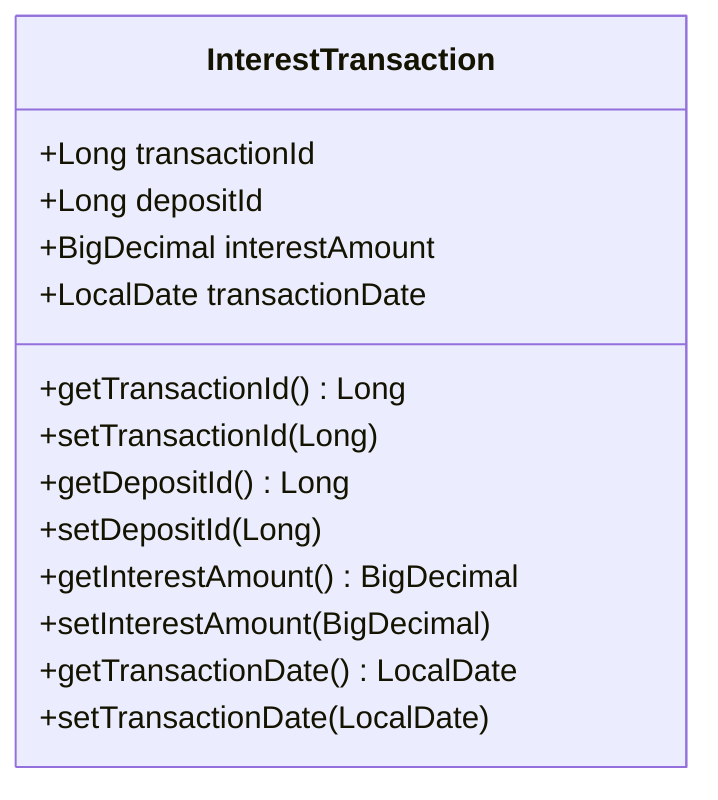

# Documentation for `InterestTransaction` Class

## Description
The `InterestTransaction` class represents an entity that records interest transactions associated with deposits in a financial application. It is mapped to the `interest_transactions` table in the database and contains fields for transaction ID, deposit ID, interest amount, and transaction date.

## Class Structure

### Annotations
- `@Entity`: Indicates that this class is a JPA entity.
- `@Table(name = "interest_transactions")`: Specifies the table name in the database.

### Fields
- `transactionId`: Unique identifier for the transaction.
- `depositId`: Identifier for the associated deposit.
- `interestAmount`: Amount of interest earned in the transaction.
- `transactionDate`: Date when the transaction occurred.

## Methods

### Constructor
```java
public InterestTransaction() {}
```
- **Description**: Default constructor for the `InterestTransaction` class.

### Getters and Setters

#### `getTransactionId()`
```java
public Long getTransactionId() { return transactionId; }
```
- **Return Value**: Returns the unique transaction ID.
  
#### `setTransactionId(Long transactionId)`
```java
public void setTransactionId(Long transactionId) { this.transactionId = transactionId; }
```
- **Parameter**: 
  - `transactionId`: The unique identifier for the transaction to set.

#### `getDepositId()`
```java
public Long getDepositId() { return depositId; }
```
- **Return Value**: Returns the deposit ID associated with the transaction.

#### `setDepositId(Long depositId)`
```java
public void setDepositId(Long depositId) { this.depositId = depositId; }
```
- **Parameter**: 
  - `depositId`: The identifier for the deposit to set.

#### `getInterestAmount()`
```java
public BigDecimal getInterestAmount() { return interestAmount; }
```
- **Return Value**: Returns the amount of interest for the transaction.

#### `setInterestAmount(BigDecimal interestAmount)`
```java
public void setInterestAmount(BigDecimal interestAmount) { this.interestAmount = interestAmount; }
```
- **Parameter**: 
  - `interestAmount`: The interest amount to set.

#### `getTransactionDate()`
```java
public LocalDate getTransactionDate() { return transactionDate; }
```
- **Return Value**: Returns the date of the transaction.

#### `setTransactionDate(LocalDate transactionDate)`
```java
public void setTransactionDate(LocalDate transactionDate) { this.transactionDate = transactionDate; }
```
- **Parameter**: 
  - `transactionDate`: The date of the transaction to set.

## Usage Example
```java
InterestTransaction transaction = new InterestTransaction();
transaction.setTransactionId(1L);
transaction.setDepositId(1001L);
transaction.setInterestAmount(new BigDecimal("5.25"));
transaction.setTransactionDate(LocalDate.now());
```

## Important Notes
- Ensure that the `transactionId` is generated automatically by the database.
- The `interestAmount` field has a precision of 19 and a scale of 4, allowing for accurate representation of monetary values.
- The class is designed to be used with JPA for ORM (Object-Relational Mapping) purposes.

## Mermaid Diagram
