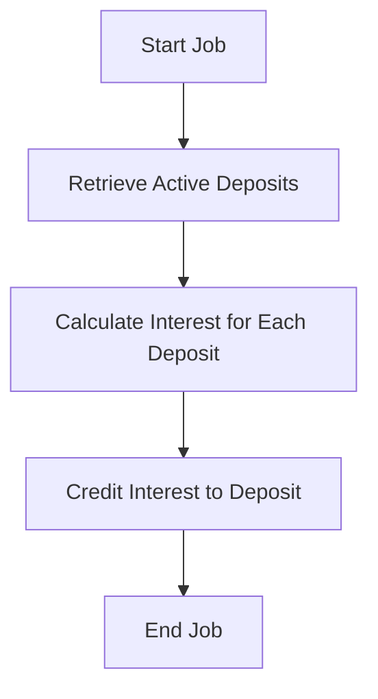

# DailyInterestCalculationJob Documentation

## Description
The `DailyInterestCalculationJob` class is a scheduled job that calculates and credits interest for all active deposits in the system. It utilizes the `DepositRepository` to retrieve active deposits and the `DepositService` to perform interest calculations and crediting.

## Methods

### `execute(JobExecutionContext context)`

#### Parameter Explanations
- **JobExecutionContext context**: This parameter provides runtime information about the job execution, including job details and the scheduler context.

#### Return Value Description
- This method does not return a value. It performs operations to calculate and credit interest for active deposits.

#### Detailed Usage Example
To use this job, it must be scheduled with a Quartz scheduler. Here’s an example of how to schedule this job:

```java
import org.quartz.JobBuilder;
import org.quartz.JobDetail;
import org.quartz.Scheduler;
import org.quartz.Trigger;
import org.quartz.TriggerBuilder;
import org.quartz.impl.StdSchedulerFactory;

// Create a scheduler instance
Scheduler scheduler = StdSchedulerFactory.getDefaultScheduler();

// Define the job and tie it to the DailyInterestCalculationJob class
JobDetail job = JobBuilder.newJob(DailyInterestCalculationJob.class)
        .withIdentity("dailyInterestJob", "group1")
        .build();

// Trigger the job to run daily
Trigger trigger = TriggerBuilder.newTrigger()
        .withIdentity("dailyInterestTrigger", "group1")
        .startNow()
        .withSchedule(CronScheduleBuilder.dailyAtHourAndMinute(0, 0)) // Runs daily at midnight
        .build();

// Schedule the job
scheduler.scheduleJob(job, trigger);
scheduler.start();
```

## Important Notes
- Ensure that the `DepositRepository` and `DepositService` are properly configured and injected for the job to function correctly.
- This job assumes that the `calculateInterest` and `creditInterest` methods in `DepositService` handle any necessary business logic and error handling.
- The job should be scheduled in a way that it does not overlap with other jobs that might modify deposit records to avoid data inconsistencies.

## Mermaid Flowchart


This flowchart illustrates the sequence of operations performed by the `execute` method in the `DailyInterestCalculationJob`.