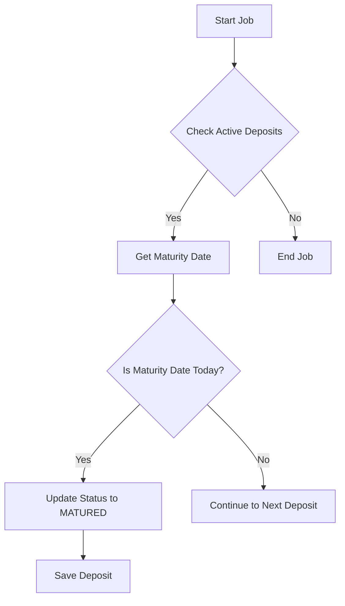

# MaturityInterestCreditJob Documentation

## Description
The `MaturityInterestCreditJob` class is a scheduled job that checks for active deposits in the system. It evaluates each deposit's maturity date and updates the status of deposits that have reached their maturity date to "MATURED". This job is part of a larger system that manages deposit accounts and is implemented using the Quartz scheduling framework.

## Methods

### `execute(JobExecutionContext context)`

#### Parameter Explanations
- **JobExecutionContext context**: This parameter provides runtime information about the job execution, including job details and the scheduler context.

#### Return Value Description
- This method does not return a value (void). It performs operations on the deposit records in the database.

#### Detailed Usage Examples
To use this job, it should be scheduled with a Quartz scheduler. Here’s an example of how it might be configured:

```java
import org.quartz.JobBuilder;
import org.quartz.JobDetail;
import org.quartz.Trigger;
import org.quartz.TriggerBuilder;
import org.quartz.Scheduler;
import org.quartz.SchedulerException;

public class SchedulerConfig {
    public void scheduleJob(Scheduler scheduler) throws SchedulerException {
        JobDetail jobDetail = JobBuilder.newJob(MaturityInterestCreditJob.class)
                .withIdentity("maturityInterestCreditJob")
                .build();

        Trigger trigger = TriggerBuilder.newTrigger()
                .withIdentity("maturityTrigger")
                .startNow()
                .withSchedule(SimpleScheduleBuilder.repeatHourlyForever(1))
                .build();

        scheduler.scheduleJob(jobDetail, trigger);
    }
}
```

## Important Notes
- Ensure that the `DepositRepository` is correctly configured and injected, as it is essential for the job's functionality.
- The job checks for deposits with the status "ACTIVE" and updates their status to "MATURED" only if the maturity date matches the current date.
- This job should be scheduled to run daily to ensure timely updates of deposit statuses.

## Mermaid Flowchart


This documentation provides a clear understanding of the `MaturityInterestCreditJob` class, its methods, and how to utilize it effectively within a deposit management system.