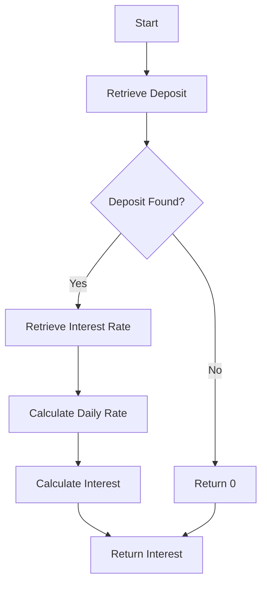

# DepositService Documentation

## Description
The `DepositService` class provides functionalities for managing deposits, calculating interest, and handling interest transactions in a banking application. It interacts with repositories to perform CRUD operations on deposits and interest transactions.

## Methods

### 1. `listDeposits()`
- **Description**: Retrieves a list of all deposits.
- **Return Value**: 
  - `List<Deposit>`: A list containing all deposit records.
- **Usage Example**:
  ```java
  DepositService depositService = new DepositService(depositRepository, interestRateRepository, transactionRepository);
  List<Deposit> deposits = depositService.listDeposits();
  ```

### 2. `calculateInterest(Long depositId)`
- **Parameters**:
  - `Long depositId`: The ID of the deposit for which interest needs to be calculated.
- **Return Value**: 
  - `BigDecimal`: The calculated interest amount for the specified deposit. Returns `BigDecimal.ZERO` if the deposit or interest rate is not found.
- **Usage Example**:
  ```java
  BigDecimal interest = depositService.calculateInterest(1L);
  ```

### 3. `creditInterest(Long depositId, BigDecimal amount)`
- **Parameters**:
  - `Long depositId`: The ID of the deposit to which interest will be credited.
  - `BigDecimal amount`: The amount of interest to be credited.
- **Return Value**: 
  - `void`: This method does not return a value.
- **Usage Example**:
  ```java
  depositService.creditInterest(1L, new BigDecimal("10.00"));
  ```

### 4. `getInterestRate()`
- **Description**: Retrieves the current interest rate.
- **Return Value**: 
  - `InterestRate`: The current interest rate object, or `null` if not found.
- **Usage Example**:
  ```java
  InterestRate rate = depositService.getInterestRate();
  ```

### 5. `placeDeposit(Deposit deposit)`
- **Parameters**:
  - `Deposit deposit`: The deposit object to be placed.
- **Return Value**: 
  - `Deposit`: The saved deposit object.
- **Usage Example**:
  ```java
  Deposit newDeposit = new Deposit();
  newDeposit.setPrincipalAmount(new BigDecimal("1000.00"));
  Deposit savedDeposit = depositService.placeDeposit(newDeposit);
  ```

### 6. `updateDeposit(Long depositId, Deposit newDeposit)`
- **Parameters**:
  - `Long depositId`: The ID of the deposit to be updated.
  - `Deposit newDeposit`: The new deposit object containing updated values.
- **Return Value**: 
  - `Deposit`: The updated deposit object, or `null` if the deposit was not found.
- **Usage Example**:
  ```java
  Deposit updatedDeposit = new Deposit();
  updatedDeposit.setPrincipalAmount(new BigDecimal("1500.00"));
  Deposit result = depositService.updateDeposit(1L, updatedDeposit);
  ```

## Important Notes
- Ensure that the `Deposit`, `InterestRate`, and `InterestTransaction` entities are properly defined in the application.
- The `creditInterest` method is transactional, meaning it will roll back changes if an error occurs during the operation.
- The interest calculation assumes a daily compounding based on the annual interest rate.

## Flowchart


This documentation provides a comprehensive overview of the `DepositService` class, its methods, and their usage, enabling developers to effectively utilize the service in their applications.